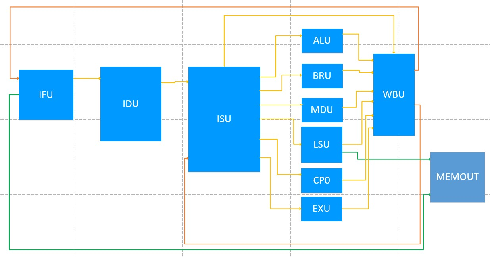

# CPU CORE设计

## 握手信号
在2个模块之间实现同步通信，使用握手信号是一个有效的实现方式。

假设模块A和模块B之间要实现通信，A需要向B发送信息。这时A和B之间将会有3组数据，A->B的valid，data，B->A的ready，valid表示当前周期模块A发送的data是有效的，需要模块B接收，ready表示B模块当前周期空闲且能够收下A模块发送来的data信号。当某个周期A,B模块之间的valid和ready同时有效，则说明这个周期内A，B之间发生了数据传输。

握手信号的作用是能够将模块之间完全地解耦开来，只有当模块A和模块B同时准备好才传输数据，将一个大型的模块分割成各个小模块可以有效地降低问题的复杂度，使得设计复杂系统能够成为可能。

## 定延迟信道(乘法器)

## 五段流水线


CORE 模块内部的功能划分为 取指部件(IFU) 译码部件(IDU) 取数发射部件(ISU)
执行部件(ALU BRU MDU LSU CP0 EXU) 回写部件(WBU)。各个部件之间使用握手型号相互连接。

### 1、取指部件(IFU)
IFU 主要负责对外的取指并发送给 IDU,能够连续取指,在 CACHE 不 MISS 的情况下
可以每个周期发送一条指令。 IFU 先通过握手信号向 MEMOUT 发送一个取指请求以及指令
的地址,然后等待数据的写回握手,最后向 IDU 发送握手信号和取得的指令。
当流水线需要冲刷的时候,IFU 会先等待其发送出去的取指请求全部取回后,才会发送
新得到的指令给 IDU。
### 2、译码部件(IDU)
IDU 主要负责指令的译码,会获得每条指令的执行部件,操作码, 2 个源操作数的来源,
目标操作数等信息并向 ISU 发射。
当流水线需要冲刷的时候,IDU 会丢弃掉其中暂存的指令及其信息。
### 3、取指部件(ISU)
ISU 主要负责指令的取数发射,寄存器堆位于 ISU 中,ISU 会保存已发射指令的目的操
作数的信息,使用阻塞来控制 RAW 和 WAW 冒险。并设计有旁路,当 WBU 回写当前指令
所需要的源操作数的时候,能够在当前周期发送出去。且每发送一条指令,会通知 WBU,
于是 WBU 便能够根据 ISU 的发射顺序来保证按序写回。
3当流水线需要冲刷的时候,IDU 会丢弃掉其中暂存的指令及其信息。
### 4、回写部件(WBU)
WBU 主要负责指令的按序写回,使用一个 FIFO 来记录 ISU 发射指令的顺序,WBU 会
按序收取各个执行部件的写回信息,当出现跳转,异常等需要冲刷流水线的指令时,会向之
前的部件发送 flush 信号。
各个执行部件负责其对应的一部分指令,当发生异常时,会统一将异常指令送至 WBU
后统一处理。
### 5、执行部件(ALU BRU MDU LSU CP0 EXU)
执行部件的任务被提交后便不会被 flush,只会在 WBU 里判断该指令是否需
要被写回。

ALU 执行除乘除法之外的算数指令。

BRU 负责判断分支跳转指令的目的地址和是否跳转

MDU 负责乘除法指令

LSU 负责 load,store 等访存指令

CP0 负责与其相关的指令:mfc0,mtc0,syscall,break,eret 等并在发生中断时做出对应的反应。

## 流水线状态机设计

每个流水段部件中都有一个寄存器 reg_valid_r,用于标志部件中的数据是否有效,
receive_flag 表示收到前一个部件发送来的数据,send_flag 表示成功发送数据到下一个部件
4中。out_valid 和 out_ready 表示输出握手。in_valid 和 in_ready 表示输入握手。本部件需要输出的信号是 out_valid 和 in_ready。
```
send_flag = out_valid & in_ready
receive_flag = in_valid & in_ready
out_valid = reg_valid_r      //当前部件的 reg_valid_r 有效时便向后输出握手有效
in_ready = !reg_valid_r || (reg_valid_r && send_flag)   //当前部件能够成功向后握手
```
并发送数据的时候或者当前部件空闲的时候可以收取前一个部件的信息。

## score board

## ICache和DCache
