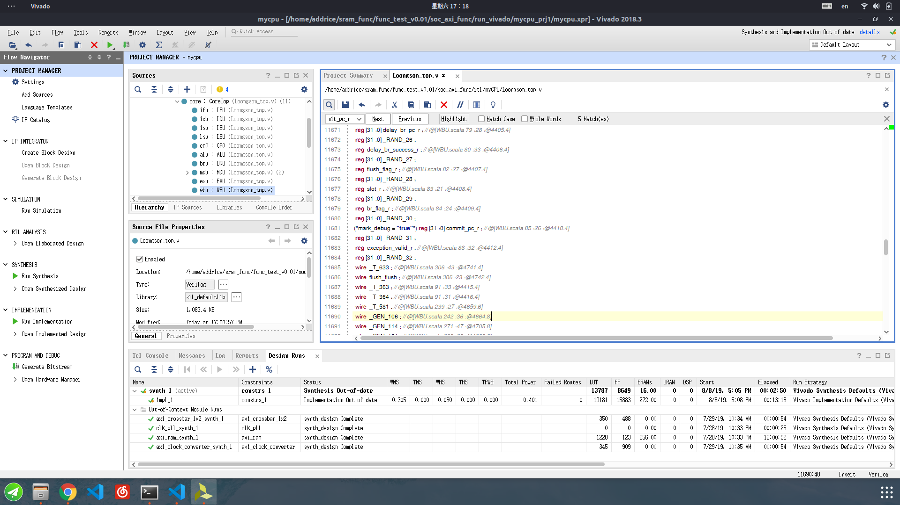
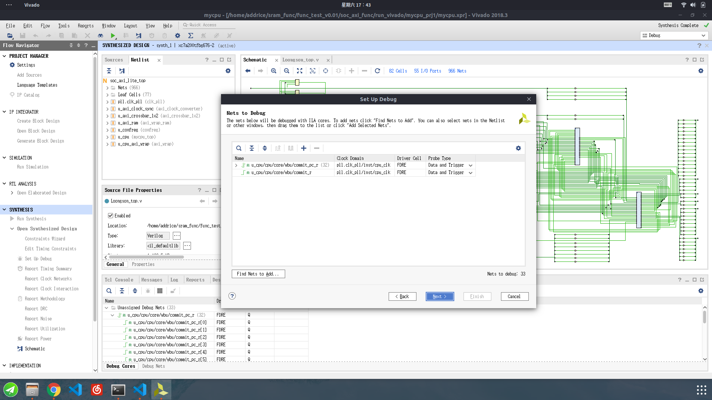
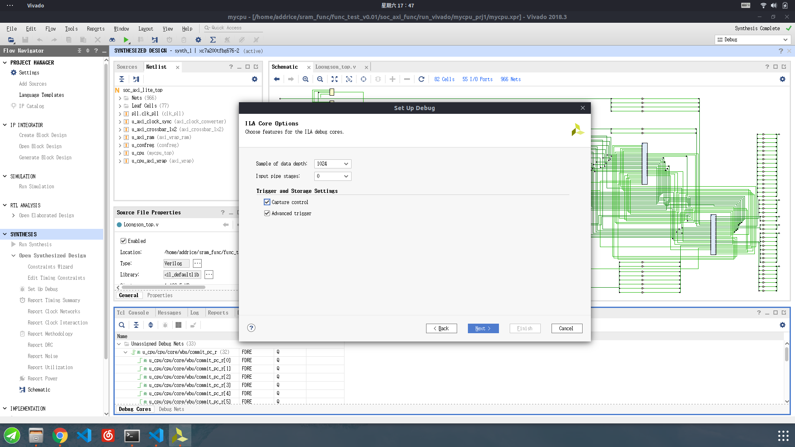
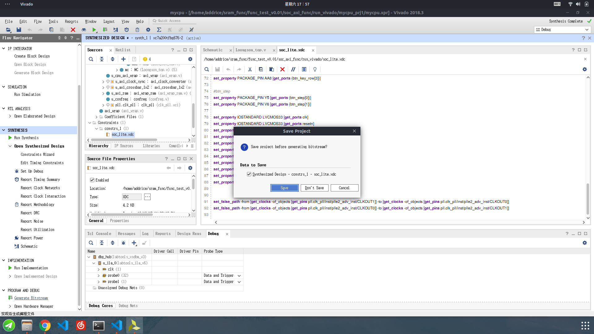
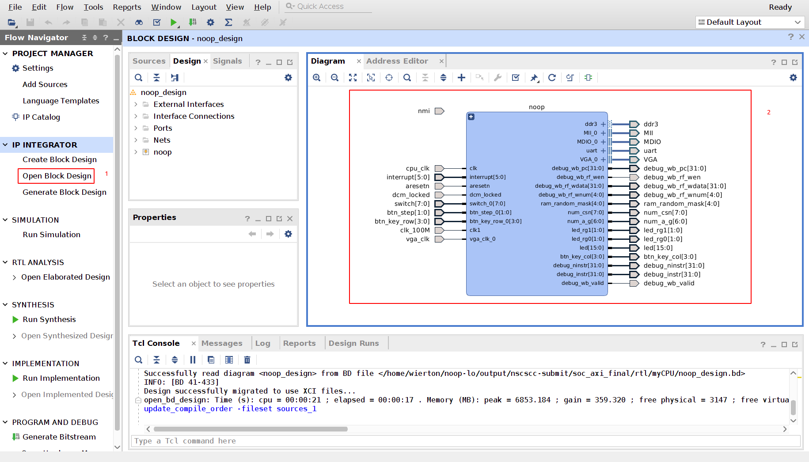

# ILA的使用方法

在最坏的情况下，你的cpu模拟可以跑，仿真可以跑，唯独上板不能跑，这个时候你便需要在上板的时候采样一些信号，来帮助你判断上板运行的状态以及进一步的调试。

有2中方法可以设置ILA，一种是在.v文件中生成，第二种是使用block design设置。
## 代码设置

在你需要采样的信号的定义前加上 
```
(*mark_debug = "true"*)
```
如图所示


然后综合(Run synthesis),完成后open Synthesized Design,点击Set up Debug，如图所示

设置过的mark_debug的信号会显示在其中，点击next，勾选Captrue control和Advanced trigger，如图所示

然后一路next完成。这一操作会修改我们的引脚文件，点击生成bitstream，save我们对综合文件的修改，如图所示

等待bitstream生成完毕上板即可。

## block design设置
如图所示，先在左边的工具栏点击open block design打开block design：



然后
